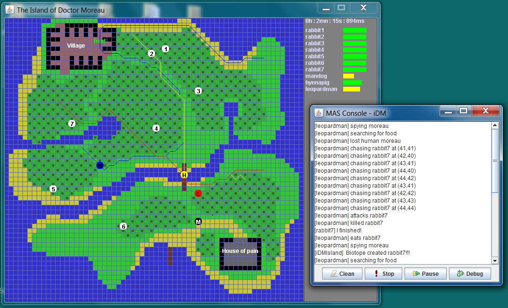

idm
===

Jason / AgentSpeak multi-agent system experiment inspired by H.G. Wells' Island of doctor Moreau.

actual screenshot

### Controls
- Use arrow keys to control the user-driven agent (Doctor Moreau)

### Agents behaviours (by order of complexity):
- Rabbits: these are preys, just moving randomly in the map. 
- Man-dog: simple behaviour, roaming and going to the village to find his food.
- Hyena-pig: same as Man-dog.
- Leopard-man: more complex behaviours roaming, chasing preys, and spying Moreau. 
- Doctor Moreau: interactive agent, use up/down/left/right arrows for moving.

### Instructions
Install http://jason.sourceforge.net. Tested with Jason 1.3.3.  
Jason installer includes jEdit, an IDE supporitng both Java and AgentSpeak idioms.   
Open `iDM\src\iDM.mas2j` in jEdit and hit the run command.

### Simulation parameters
In jEdit, the iDM.mas2j project file contains editable parameters that can be modified:  
- Map (a GIF file that can be edited)
- Number of preys (rabbits)
- Preys re-generation 
- Simulation step (ms)
- Agents to simulate
- visuals: window size, animation, grid and agents infos

### Todo
- Add a global blood variable increasing in time and evolve local behaviours (i.e AgentSpeak rules) to a global predator model. Rabbits should extinct since they are limited, and humanimals should fight each other.
- Add rules to protect Moreau that should be less and less substainable due to blood level and preys extinction, and finally leading to attack Moreau to death (alternatively we could have a different ending, giving Moreau means to defend himself i.e. killing humanimals).

### Reference
- H. G. Wells. (1896). The island of Dr Moreau.
- Bordini, Rafael H. Hübner, Jomi Fred. Wooldridge, Michael. (2007). Programming Multi-agent Systems in AgentSpeak Using Jason, Wiley.
